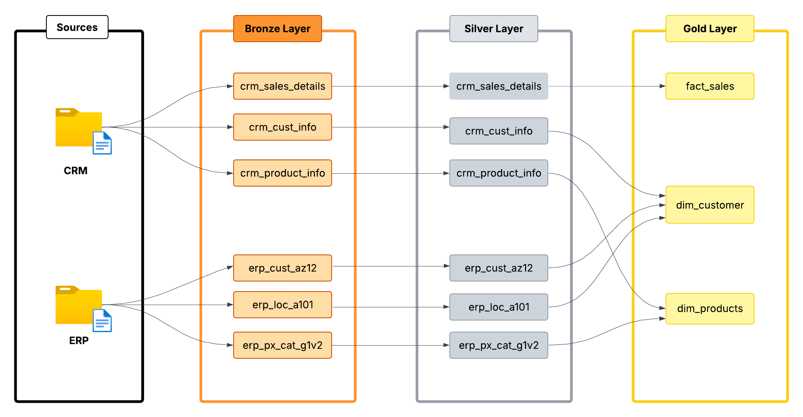
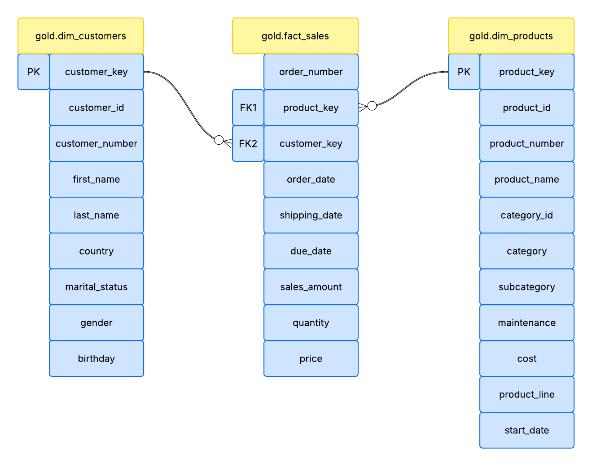
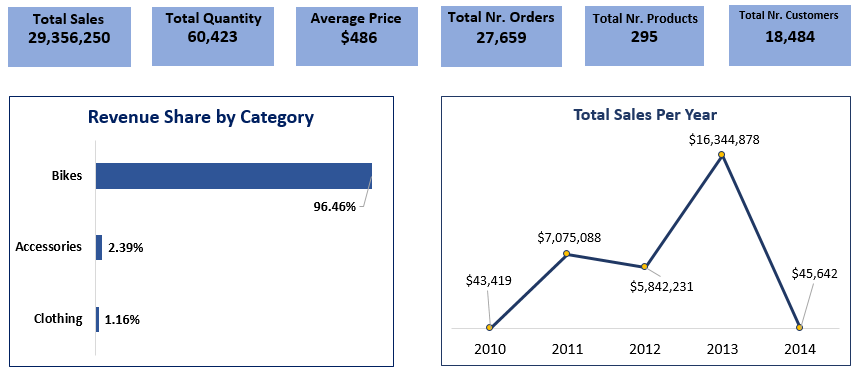
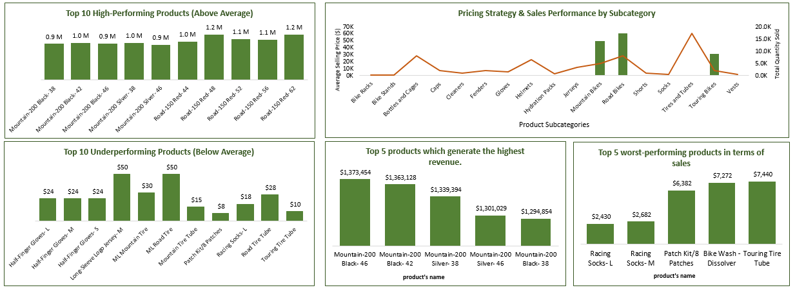
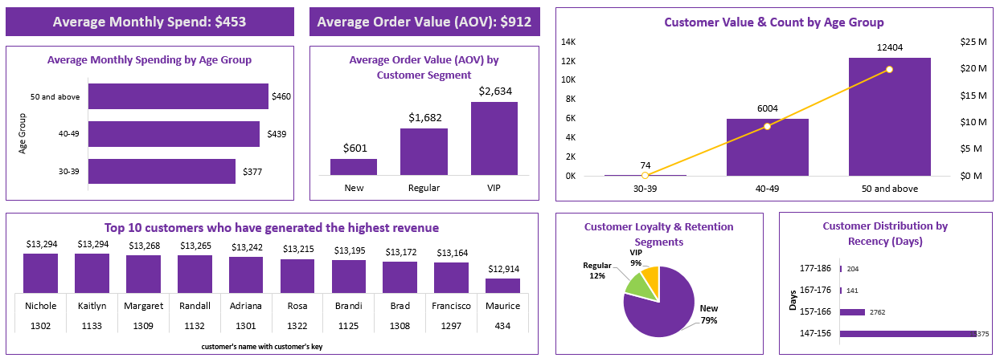
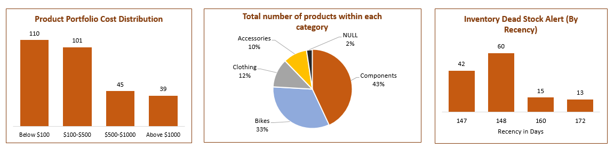
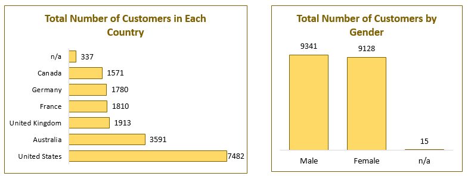
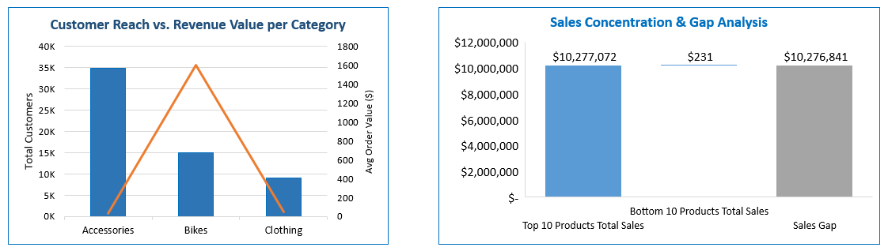

# End-to-End Sales Data Warehouse and Analytics Pipeline

In this project, I transformed messy raw data from CRM and ERP sources into analytics-ready datasets using SQL and the Medallion Architecture. By building this end-to-end pipeline, I extracted meaningful business insights to support strategic decision-making, demonstrating a step-by-step methodology for converting raw, fragmented data into actionable business intelligence.

---

## 🎯 Objectives

### ⚙️ Data Engineering Goals
- Build a modern data warehouse using SQL Server
- Ingest and consolidate data from CRM and ERP source systems
- Implement Medallion Architecture (Bronze → Silver → Gold)
- Develop robust ETL pipelines for data cleansing and transformation
- Ensure high data quality, consistency, and integrity

### 📊 Data Analytics Goals

* **Sales Performance Analysis:** Evaluate historical sales data to identify growth patterns and seasonal trends.
* **Customer Behavior & Segmentation:** Analyze purchasing habits to categorize customer groups and understand behavioral drivers.
* **Product Trend Evaluation:** Assess product performance and contribution analysis to identify high-impact items and market trends.
* **Technical Insight Extraction:** Utilize advanced SQL techniques including ranking, performance evaluation, and contribution analysis to derive actionable intelligence.
* **Data-Driven Decision Support:** Uncover visual patterns through Excel to translate complex data into strategic business recommendations.

---

## 🛠️ Tech Stack & Tools

* **Database & Warehousing:** SQL Server (T-SQL) 
* **Data Transformation:** SQL (Views, Joins, Aggregations, CTE, Window Functions) 
* **Business Intelligence & Reporting:** Microsoft Excel 
* **Version Control:** Git & GitHub
* **Core Concepts:** Data Warehousing (Medallion Architecture), Exploratory Data Analysis (EDA), KPI Development, ETL (Extract, Transform, Load).

---

## 📂 Data Source

The dataset for this project consists of six source files provided by my **Mentor**, representing real-world data extracted from **CRM** and **ERP** systems. These files serve as the starting point for the data pipeline:

### 📱 CRM System Files:
* `cust_info.csv`: Contains customer-related information.
* `prd_info.csv`: Contains product details and specifications.
* `sales_details.csv`: Records of historical sales transactions.

### 🏢 ERP System Files:
* `CUST_AZ12.csv`: Internal customer tracking data.
* `LOC_A101.csv`: Location and branch-specific data.
* `PX_CAT_G1V2.csv`: Product categorization and inventory data.

---

## 📁 Project Structure

The repository is organized as follows:

```text
End-to-End Sales Data Warehouse and Analytics Pipeline/
├── dashboards/                                   
│   ├── cross_analysis.PNG                        
│   ├── customer_insights.PNG                     
│   ├── executive_dashboard.PNG                   
│   ├── geo_and_demographics.PNG                  
│   ├── product_and_inventory.PNG                
│   └── sales_and_product_performance.PNG
├── datasets/
│   ├── source_crm                        
│   ├── source_erp                             
├── docs/                                       
│   ├── data_flow.png                           
│   ├── data_models.png                         
├── scripts/
│   ├── Warehouse                                
│   |  ├── init_database.sql                    
│   |  ├── 01_bronze_layer.sql                            
│   |  ├── 02_silver_layer.sql                             
│   |  ├── 03_gold_layer.sql
│   ├── Analytics                               
│   |  ├── 01_database_exploration.sql                     
│   |  ├── 02_dimension_exploration.sql                           
│   |  ├── 03_data_range_exploration.sql                           
│   |  ├── 04_measures_exploration.sql
│   |  ├── 05_magnitude_analysis.sql                     
│   |  ├── 06_ranking_analysis.sql                             
│   |  ├── 07_change_over_time_analysis.sql                             
│   |  ├── 08_cumulative_analysis.sql 
│   |  ├── 09_performance_analysis.sql                     
│   |  ├── 10_data_segmentation.sql                            
│   |  ├── 11_part_to_whole_analysis.sql                            
│   |  ├── 12_customer_report_view.sql
│   |  ├── 13_product_report_view.sql                        
├── tests/
│   ├── quality_checks_gold.sql
│   ├── quality_checks_silver.sql                                    
├── README.md                                  
├── LICENSE                                     
```
---

## ⚙️ Data Engineering

### 🗺️ Data Flow Architecture
Below is the architectural representation of the data pipeline, following the Medallion Architecture (Bronze, Silver, and Gold layers).

<p align="center">
  
</p>

To ensure data reliability and quality, I implemented a **Medallion Architecture**, organizing data into three distinct layers:

* **🥉 Bronze (Raw Layer):** Acts as the landing zone for raw source files. The data is kept in its original format to maintain a complete history (data lineage) and allow for reprocessing if needed.
* **🥈 Silver (Curated Layer):** The "Cleaning" zone. In this layer, data from CRM and ERP is merged, cleaned, and standardized. Duplicates are removed, and inconsistent formats are resolved to create a single version of truth.
* **🥇 Gold (Analytical Layer):** The "Business-Ready" zone. Data is modeled into **Fact** and **Dimension** tables (Star Schema), optimized for high-speed analytical queries and dashboarding.

### 🚀 ETL Process Details

I developed a comprehensive ETL pipeline to ensure the raw data is transformed into a high-quality analytical asset.

### 1. Extraction (Source Ingestion)
* **Extraction Method:** Implemented a **Pull Extraction** strategy.
* **Extraction Type:** **Full Extraction** of source datasets.
* **Techniques:** Utilized **File Parsing** to ingest raw CSV data into the staging environment.

### 2. Transformation (Data Refining)
Data was cleaned and enriched using advanced SQL techniques to ensure it was "analytics-ready":

* **Data Cleansing:** * Performed **Data Type Casting** for schema consistency.
    * Removed duplicates and applied **Data Filtering** to eliminate noise.
    * Handled missing data (NULLs), invalid values, and unwanted white spaces.
    * Identified and handled anomalies through **Outlier Detection**.
* **Data Integration & Enrichment:** * Unified disparate data from multiple sources (CRM + ERP).
    * Created **Derived Columns** and implemented **Business Rules & Logic**.
    * Applied **Normalization and Standardization** for unified naming conventions.
    * Performed **Data Aggregations** to pre-calculate key metrics.

### 3. Load (Data Warehousing)
* **Processing Type:** Optimized for **Batch Processing**.
* **Load Methods:** Implemented various strategies including **Full Load** (Truncate & Insert, Drop & Create) and **Upsert** for incremental updates.
* **Slowly Changing Dimensions (SCD):** Applied **SCD Type 1** logic to maintain the most current state of Dimension tables (Customers/Products) without keeping historical changes.

### 🗺️ Schema Diagram
Below is the Entity Relationship Diagram (ERD) representing the data warehouse structure:

<p align="center">
  
</p>

### Data Model Structure:
* **Fact Table (`gold.fact_sales`):** Stores business metrics like `sales_amount`, `quantity`, and `price`, linked via foreign keys to dimensions.
* **Dimension Tables:**
    * **`gold.dim_customers`:** A unified master record for customers, including demographics like country, marital status, and gender.
    * **`gold.dim_products`:** A centralized product catalog with attributes like category, product line, and cost.

### Relationships:
The model utilizes a **One-to-Many (1:M)** relationship, ensuring high-speed joins and an intuitive structure for dashboarding in Power BI.

---

## 🔍 Exploratory Data Analysis (EDA)

Before proceeding to advanced visualization, I performed a deep dive into the Gold layer to validate data integrity, understand the business footprint, and audit the quality of the dataset.

### 1. Business Footprint & Sales Performance
A comprehensive audit of the dataset reveals a healthy 4-year operational span:
* **Time Coverage:** From **2010-12-29** to **2014-01-28**.
* **Revenue:** A total of **29,356,250** in sales generated from **60,423** items.
* **Order Structure:** I identified **27,659 unique orders** spanning **60,398 order lines**. 
    * This indicates that a typical order contains multiple items (**~2.18 items per order**).

### 2. Efficiency & Value Metrics (Derived Insights)
* **Average Order Value (AOV):** **1,061.36** (Calculated from Sales / Unique Orders).
* **Revenue per Item:** **485.85** (This perfectly aligns with the reported **Average Price of 486**, confirming cross-table consistency).
* **Customer Value:** Every customer in this dataset is 'active,' contributing an average of **1,588.20** in revenue over the period.

### 3. Product Catalog Composition (Assortment)
The product catalog consists of **295 unique SKUs**, showing a heavy focus on high-ticket and technical items:
* **Core Focus:** **Components (44.1%)** and **Bikes (33.7%)** make up **~78%** of the inventory.
* **Supplementary:** Clothing (12.2%) and Accessories (10.1%) complete the assortment.

### 4. Customer Demographics & Data Quality Observations 🚩
* **Gender Balance:** The base is nearly perfectly balanced with **50.6% Male** and **49.4% Female** customers.
* **Age Distribution Red Flag:** While the youngest customer is **40**, the oldest birthdate recorded results in an age of **110**. 
* **Data Quality Note:** An age of 110 is unusual for this retail profile. This has been flagged as a potential **data-quality artifact** (placeholder or default birthdate), requiring careful handling during targeted segmentation.
  
---

## 📊 Dashboards & Business Insights

### 📊 Executive Dashboard

<p align="center">
  
</p>

### 💡 Key Insights:

* **Revenue Performance:** Total revenue reached **$29.36M**, with an average order value of **$486** across **18.4K customers**.
* **Product Dominance:** **Bikes** dominate the business, contributing **96%+** of total revenue, while other categories have minimal impact.
* **Sales Trends:** Sales peaked in **2013 ($16.3M)** but dropped sharply in **2014**, indicating a potential anomaly or business issue.
* **Business Risk:** The business is highly dependent on a single category, highlighting both **strength and risk**.

---

### 📈 Sales & Product Performance

<p align="center">
  
</p>

### 💡 Key Insights:

* **Revenue Concentration:** A small group of high-value products (e.g., **Road-150, Mountain-200**) generates the majority of revenue, with top items contributing approximately **$1M each**.
* **Low-Value Impact:** Several low-value products (e.g., accessories) contribute **negligible revenue**, indicating limited individual financial impact.
* **Price vs. Volume Dynamics:** High-priced bikes drive revenue despite low sales volume, while low-priced items like tires and tubes drive **high purchase frequency**.
* **Strategic Positioning:** The business relies on a **dual strategy**: using bikes as the primary revenue drivers and accessories as the drivers for customer transaction frequency.

---

### 👥 Customer Insights

<p align="center">
  
</p>

### 💡 Key Insights:

* **Core Segment:** The majority of revenue (**~$20M**) and customers (**12.4K**) come from the **50+ age group**, making them the core customer segment.
* **Spending Behavior:** Customer value increases with age, showing a **strong positive correlation** between age and spending behavior.
* **VIP Impact:** VIP customers generate **~4x higher order value** compared to regular customers, highlighting their high impact on revenue.
* **Customer Loyalty:** Around **79% of customers are new**, but they contribute relatively lower order value compared to repeat customers.
* **Engagement & Retention:** Most customers are active within a recent time window, indicating **strong short-term engagement** but weaker long-term retention.
* **High-Value Concentration:** A small group of top customers contributes significantly (**> $13K each**), showing high-value customer concentration.

---

### 📦 Product & Inventory

<p align="center">
  
</p>

### 💡 Key Insights:

* **Pricing Strategy:** Most products are priced **under $500 (211 items)**, indicating a strong focus on budget-friendly offerings.
* **Premium Drivers:** Only **39 premium products (> $1,000)** exist, but they are likely the primary revenue drivers.
* **Stock Concentration:** Inventory is heavily concentrated in **Components (43%)**, while Bikes account for only **33% of stock**.
* **Inventory Mismatch:** There is a clear mismatch between inventory distribution and revenue contribution, as components generate relatively low revenue.
* **Inventory Aging:** A significant number of products have remained unsold for **160–172+ days**, indicating potential dead stock.
* **Idle Capital:** Around **28+ products** are effectively idle inventory, tying up capital and warehouse space.

### ⚠️ Business Recommendation:

* **Overstocking:** The business is overstocked in low-performing categories, especially **components**.
* **Dead Stock Liquidation:** Dead stock should be cleared through **discounts or bundle offers** to free up capital.
* **Strategic Realignment:** The inventory strategy should be realigned to better match **high-revenue categories like Bikes**.
---

### 🌍 Geo & Demographics

<p align="center">
  
</p>

### 💡 Key Insights:

* **Primary Market:** The **United States** dominates the customer base (**7,482 customers**), making it the primary market.
* **Growth Potential:** **Australia (3,591 customers)** shows strong growth potential as the second-largest market.
* **Stable European Presence:** European countries (UK, France, Germany) have a balanced and stable customer presence (**~1.8K–1.9K each**).
* **Expansion Opportunity:** **Canada** has the lowest penetration (**1,571 customers**) among key markets, indicating significant expansion opportunities.
* **Gender Balance:** Customer distribution by gender is highly balanced, with **male (9,341)** and **female (9,128)** customers being nearly equal.
* **Targeting Efficiency:** Products show **gender-neutral appeal**, making broad targeting more effective than gender-specific campaigns.
* **Data Quality:** A small portion of missing demographic data exists (country/gender), suggesting minor **data quality gaps**.

### 📌 Business Recommendations:

* **Market Prioritization:** Marketing efforts should prioritize the **USA and Australia** as core revenue markets.
* **Localized Campaigns:** European regions present steady growth opportunities through **localized marketing campaigns**.
* **Data Improvement:** Improving **data completeness** will enhance future segmentation and targeting strategies.
---

### 🔄 Advanced / Cross Analysis

<p align="center">
  
</p>

### 💡 Key Insights & Business Impact:

* **Customer Reach vs. Revenue:** **Accessories** drive the highest customer reach (**~35K**) but generate the lowest average order value, making them a strong entry-level category rather than a revenue driver.
* **Profit Engine:** **Bikes** attract fewer customers (**~15K**) but generate the highest average revenue (**~$1.6K**), positioning them as the core profit engine of the business.
* **Upselling Potential:** This creates a clear **upselling opportunity**, where accessory customers can be converted into high-value bike buyers.
* **Revenue Concentration:** The business shows extreme revenue concentration, with the **top 10 products** generating **~$10.28M**, highlighting heavy dependency on a small set of items.
* **Bottom Tier Impact:** In contrast, the **bottom 10 products** contribute only **$231**, indicating negligible business value.
* **Performance Gap:** The massive performance gap (**~$10.27M**) between top and bottom products shows a **highly skewed product portfolio**.
* **Supply Chain Priority:** Overall, the business relies heavily on a few **“star” products**, making supply chain stability for these specific items absolutely critical.

---

## 📌 Conclusion
This project demonstrates how raw data from a data warehouse can be transformed into meaningful business insights using the combined power of **SQL and Excel**. It highlights key patterns in sales, customer behavior, and product performance to support effective, data-driven decision-making.

---

## 📬 Contact
* **Author:** Maksuda Akter
* **E-mail:** suborno200139@gmail.com
